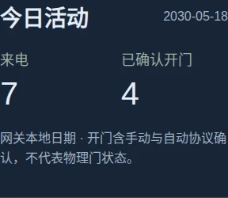

# FERMAX LYNX Gateway

### A quieter clock. A clearer view of who's at the door.

Turn a compatible LYNX installation into a local, tablet-friendly intercom experience:
a room clock when it's quiet, a large entrance view when someone arrives, and the
controls you need within reach. Runs on Linux, with an optional Raspberry Pi display.

[**Get started**](docs/user-guide.md) · [**中文用户手册**](docs/user-guide.zh-CN.md) · [**Explore every screen**](docs/demo-gallery.md) · [**Download a release**](https://github.com/helixzz/fermax-lynx-gateway/releases) · [**Report an issue**](https://github.com/helixzz/fermax-lynx-gateway/issues)


*Version 0.7.0 adds [direct Home Assistant integration](docs/home-assistant.md), alongside independent gateway sound, the 16-track library and tablet clocks.
See [changelog](CHANGELOG.md) for release scope.
All images use synthetic data and an original illustrated entrance.*

## Make it feel at home

| A clock for your room | A clock with character |
|---|---|
|  |  |
| **Editorial** — quiet, spacious numerals. | **Tube** — warm light and a vintage glass effect. |
|  |  |
| **Digital** — bold digits for a quick glance. | **Analog** — a classic face with ticking or sweeping seconds. |

Show or hide seconds. Choose your own volume. Preferences stay with each tablet;
credentials do not go into browser storage. A first touch reveals controls without
also operating the door.

## See more. Reach less.

The video page uses the full viewport and preserves the complete 4:3 image. A compact
header and translucent, large touch controls sit at its edges. Landscape makes the
most of a tablet's screen; portrait keeps the image uncropped.

- **Incoming video and previews:** see an entrance, end a visit, or use manual opening
  when the active session and panel permit it. There is no fake “answered” state.
- **A familiar sound:** administrators choose 16 original short melodies or upload a
  music excerpt. Loop for 15, 30, 45 or 60 seconds; 30 is the default. Muting or ending
  the visit stops playback, and reconnecting does not restart the whole ringing window.
- **Stay connected:** scoped device grants, automatic short-session renewal, heartbeat
  status and recovery after network interruptions or service restarts.
- **Manage locally:** revoke individual tablets, manage the existing automatic-opening
  policy, inspect events and export the journal. The gateway owns automatic opening;
  multiple tablets do not each repeat it.


[Music sources and offline audition →](docs/ringtones.md)


[Read the illustrated guide →](docs/user-guide.md) · [查看中文操作步骤 →](docs/user-guide.zh-CN.md)

## Welcome Home Assistant

Let a doorbell event start a household notification, show the current visitor image,
or check today's visits from your HA dashboard. The gateway connects directly over
your local network: **no MQTT broker, cloud account or extra HA OS service**.

Choose which entrances HA can see. Start with read-only state and events; enable
camera or explicit controls only if needed. The gateway keeps ringing and following
its existing automatic-opening policy when HA is offline.


[Set up Home Assistant →](docs/home-assistant.md) · [Install the custom integration →](https://github.com/helixzz/ha-fermax-lynx)

The custom integration supports manual or HACS custom-repository installation.
It is not yet listed in the HACS default store. Visitor images are periodic stills;
two-way audio and physical door-position sensing are not implemented.

## Is this right for your installation?

This is an **experimental, unofficial interoperability project** for compatible
FERMAX VIVO / LYNX systems. You need a Linux host, separate intercom/home network
interfaces, your own valid site configuration and a compatible 24-byte protocol key.
No key, vendor firmware, private configuration or real camera image is distributed.

| Available in this branch | Still outside the current scope |
|---|---|
| Incoming video, entrance preview, permitted door controls, event journal | Two-way voice and browser microphone support |
| Tablet mode, clock choices, device authorization and configurable ringing | Recording, Home Assistant entities, webhooks and MCP |
| Existing automatic-opening policy and optional SPI display | General compatibility with every building or firmware |

Old iPadOS 15, actual tablet sound, 72-hour foreground operation and seven-day
observation still need field validation. Background/locked-screen ringing is not
promised. HTTP is intended for a trusted LAN; HTTPS support is a separate milestone.
A protocol acknowledgement alone does not establish physical opening or elevator behavior.

## Start with a release

Download a [tagged source release](https://github.com/helixzz/fermax-lynx-gateway/releases),
verify its checksum and extract it. From that directory on Debian / Raspberry Pi OS:

```sh
sudo apt update
sudo apt install python3-pil python3-protobuf python3-pycryptodome python3-enet python3-av alsa-utils
python3 -m fermax.admin init
python3 -m fermax.admin password
# Set your site values in ~/.local/state/fermax/config.json and install your own edk.
chmod 600 ~/.local/state/fermax/edk
python3 -m fermax.main
```

The generated configuration contains documentation addresses, so it cannot be used
unchanged. Configure Linux network addresses separately, keep the intercom interface
without a default route, and avoid an address conflict with the original monitor.
Then open `http://<home-ip>:8765/` and follow the [first-use guide](docs/user-guide.md).
For a system service and optional LCD, use the [deployment guide](docs/deployment.md).

## Explore or contribute

| For users | For contributors |
|---|---|
| [English user guide](docs/user-guide.md) / [中文手册](docs/user-guide.zh-CN.md) | [Contributing](CONTRIBUTING.md) / [coordination](AGENTS.md) |
| [Every screen, with captions](docs/demo-gallery.md) | [API](docs/api.md) / [protocol scope](docs/protocol.md) |
| [Product overview / 项目简介](docs/product.md) | [UI decisions and sources](docs/phone-design.md) |
| [Releases and version rules](docs/releases.md) | [Roadmap](docs/roadmap.md) / [tests](docs/phone.md#limitations-and-validation) |

The gallery also includes a [local HTML demo viewer](docs/demo/index.html): open it
from a downloaded checkout to browse all previews without running a gateway.

MIT for the original implementation; dependencies retain their licenses. FERMAX,
VIVO and LYNX identify compatibility targets. This project is not affiliated with
or endorsed by their owners.

### 今日活动，抬眼可见

管理员 Web 与实体屏幕显示今日来电和已确认开门；话机待机用图标与数字安静呈现。统计跨重启保留，按网关本地日期换日，每台话机仅显示授权入口。开门计数表示协议确认，不是物理门状态。[了解统计与图标](docs/daily-statistics.md)。



### 更安静的话机

时钟、日期与今日活动集中呈现，连接详情收进操作面板；自动开门、铃声异常与断线保留明确提示。轻触空白或右下角图标即可操作。[查看界面与手册](docs/user-guide.zh-CN.md#安静待机)。


