# 界面图集 · Interface gallery

这些 v0.5.0 预览由真实界面自动截图生成。住户、入口、视频与音频均为合成示例；Screenshots show version 0.5.0 using synthetic data.

[中文手册](user-guide.zh-CN.md) · [English guide](user-guide.md) · [离线交互图集](demo/index.html)

下载仓库后在浏览器打开 `docs/demo/index.html` 可切换预览，打开 [sound.html](demo/sound.html) 可离线试听 16 首铃声。GitHub 页面可直接浏览以下全部截图。

## 网关独立响铃 · Gateway sound

独立开关、音量、输出选择与明确的测试声音。

## 首选设备失联 · Missing output

保留首选偏好，显示设备状态并自动降级。

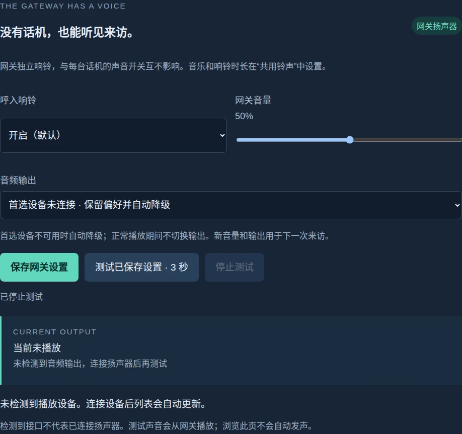

## 实体屏幕设置 · LCD settings

声音与自动开门分别进入，保留大触控按钮。

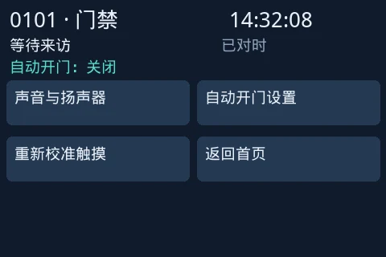

## 实体屏幕声音 · LCD sound

本机开关、音量、实际输出及三秒试音。

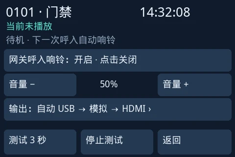

## 实体输出选择 · LCD outputs

大按钮分页选择自动或具体设备。

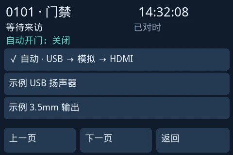

## 书页时钟 · Editorial

舒展的衬线数字与低对比度状态。

## 数字时钟 · Digital

醒目的数字，适合远距离查看。

## 模拟时钟 · Analog

刻度与指针；秒针可隐藏、跳动或平滑移动。

## 电子管时钟 · Nixie

由 CSS 绘制的暖色玻璃与发光数字。

## 无秒显示 · Hidden seconds

隐藏秒数，让空闲界面更安静。

## 话机授权 · Enrollment

管理员选择设备名称与入口范围。

## 话机偏好 · Preferences

本机时钟、秒针、音量与入口预览。

## 最近活动 · Recent activity

展开查看最近三项活动。

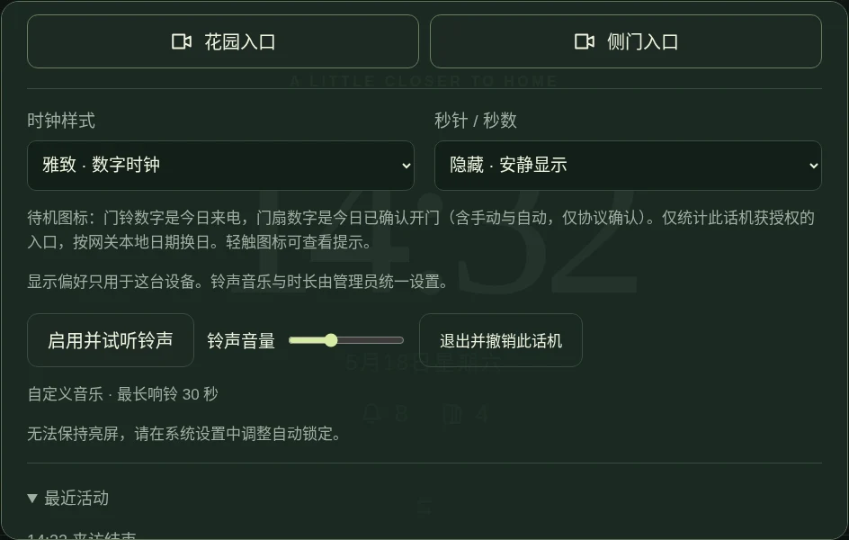

## 入口预览 · Preview

完整保留 4:3 画面，操作浮在画面上。

## 来访画面 · Incoming visit

紧凑标题与大触控按钮，音乐按设定时长循环。

## 响铃结束 · Ring window ended

音乐停止后仍可查看画面和操作。

## 本次静音 · Muted visit

只静音当前来访。

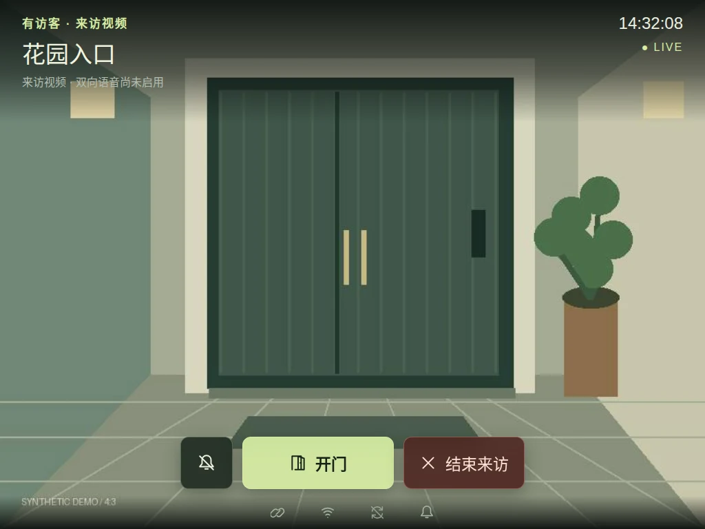

## 竖屏平板 · Portrait tablet

完整画面居中，保留必要留白。

## 手机竖屏 · Narrow screen

较窄屏幕仍保留完整画面与操作。

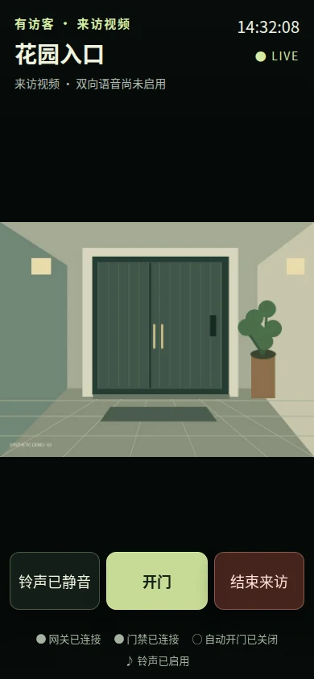

## 手机横屏 · Short landscape

短横屏使用紧凑的覆盖控件。

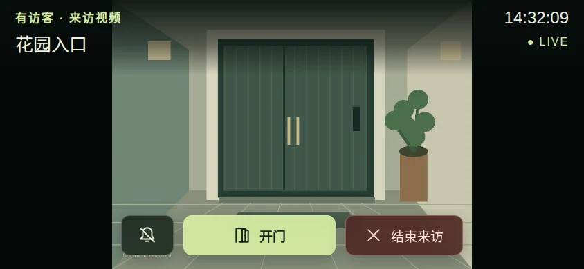

## 画面过期 · Stale frame

不把旧帧当成实时画面。

## 连接中断 · Offline

状态清楚呈现，断线时禁用控制。

## 授权撤销 · Revoked

撤销后退出话机，重新授权才能使用。

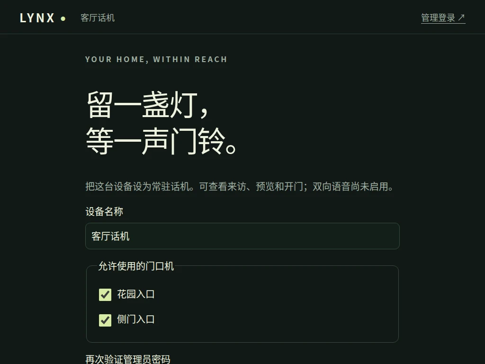

## 限时自动开门 · Timed policy

已启用时仅显示状态、截止时间和停止按钮。

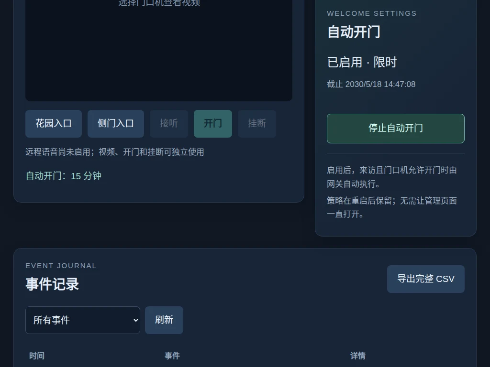

## 无时限自动开门 · Unlimited policy

只提供停止操作，隐藏再次启用和时长选择。

## 管理页失联 · Unknown policy state

无法确认服务器状态时隐藏策略操作，恢复后重新读取。

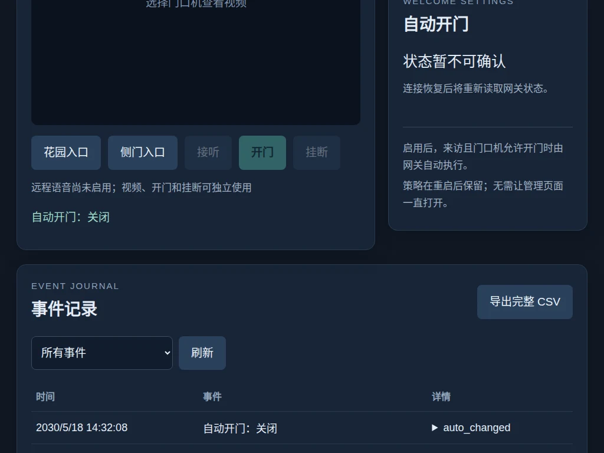

## 放大管理页 · 200% layout

导航自然换行，入口按钮不重叠。

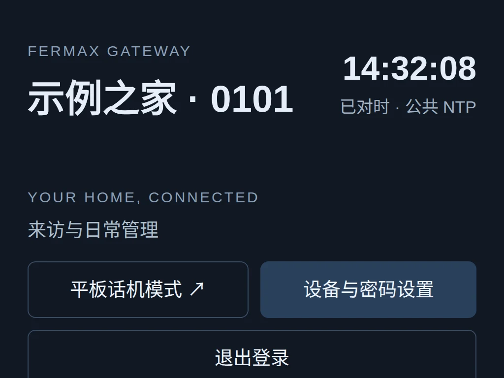

## 设置导航 · Settings navigation

铃声、话机设备、网关配置和密码按任务分区。

## 16 首铃声 · Ringtone library

点击选择并试听，保存后用于下一次来访。

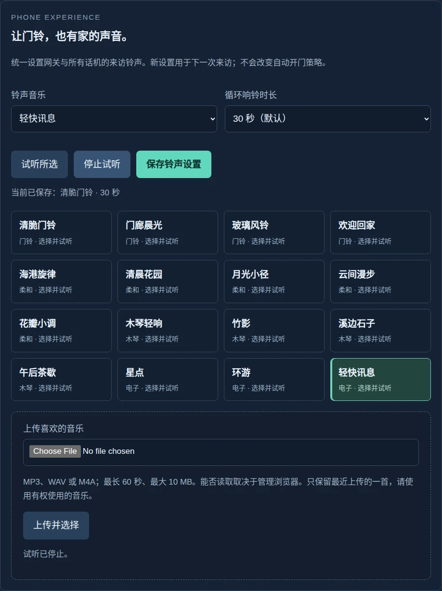

## 管理员登录 · Sign in

独立的管理员登录入口。

## 管理首页 · Dashboard

网关、入口、策略与活动概览。

## 内置铃声 · Built-in melodies

管理员配置铃声及 15/30/45/60 秒时长。

## 自定义音乐 · Custom music

导入、试听并保存自己的音乐。

## 网关配置 · Configuration

身份、接口与入口配置；保存不改变系统网卡地址。

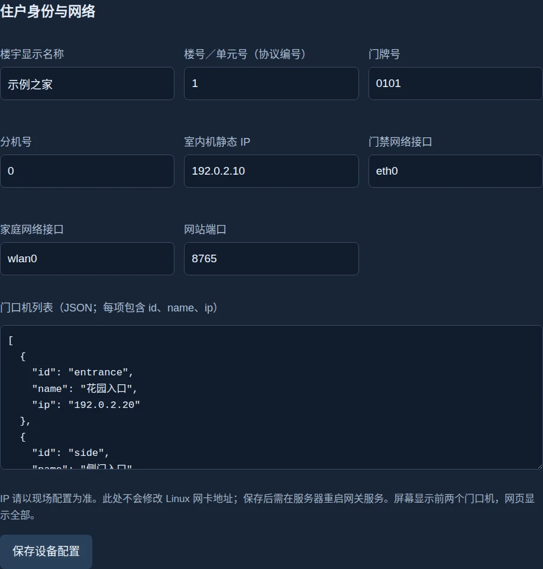

## 密码设置 · Password

修改管理员密码。

## 事件日志 · Journal

查询并导出网关活动记录。

## 设备管理 · Devices

查看设备授权及其入口范围。

## Reproduce

See [capture commands and test coverage](phone.md#display-and-ringing-preferences). Source and image hashes are recorded in [manifest.json](demo/manifest.json).
