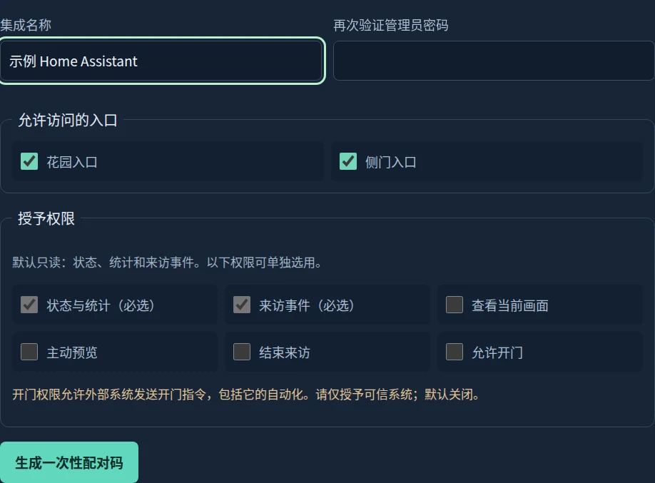

# Home Assistant / 家庭自动化

Connect HA directly to the gateway on your trusted home network. No MQTT broker,
cloud account or extra HA OS service is needed. The companion custom integration
has its own [repository and installation guide](https://github.com/helixzz/ha-fermax-lynx).

Requirements: gateway **0.7.0+**, Home Assistant **2026.9.0+**, integration API schema 1.
HA 2026.9.0 and 2026.9.1 are the initial tested versions. The gateway remains on its
Linux host; the HA integration runs inside Home Assistant, including HA OS.

## Pair in a few steps

1. In gateway Web administration, open **Settings → External integrations**
   (设置 → 外部集成). Name the authorization and select its entry panels.
2. Keep **state and events** for notifications and statistics. Optionally grant
   **camera**, **preview**, **end call** or **opening**. Enter the administrator
   password to generate a code, valid for five minutes and one exchange.
3. Install the companion integration manually or through a HACS custom repository,
   then restart HA. HACS itself is optional. Default-store listing is a later step.
4. In HA, select **Settings → Devices & services → Add integration → FERMAX LYNX
   Gateway**. Enter the gateway URL, for example `http://gateway.local:8765`, and code.
5. HA creates a gateway device and the permitted panel devices. Build notifications
   using the companion guide's `fermax_lynx_doorbell` event example.

The code disappears when leaving its settings page. Create a new code if it expires.
HA retains an independent integration token, not the administrator password. The
authorization list lets an administrator revoke a single integration. Password
changes also invalidate all integration credentials and unexchanged codes.

## What appears in HA

| Capability | Behavior |
|---|---|
| Daily visits and opening confirmations | Counts within the authorized entrances; date follows the gateway's local calendar |
| Network, call and automatic opening | Read-only status; HA does not take over the automatic-opening policy |
| Doorbell and activity | Fresh live events, with duplicate suppression; historical events do not ring again |
| Visitor image | Current JPEG from an active call or explicit preview; reading the camera never starts a call |
| Preview / end call | Only with the corresponding permission |
| Request opening | Explicit permission plus manual entity enablement in HA; requires the current authorized session |

An opening confirmation is the panel's protocol response, not a door-position
measurement. There is no lock entity, physical door sensor or two-way audio. A 202
control response means queued, not completed; expired or revoked requests are
cancelled before dispatch, and uncertain opening outcomes are never retried by HA.

## Recovery and upgrades

On interruption HA marks entities unavailable and reconnects. Replayed journal
entries only advance its cursor; missed doorbells are intentionally not turned into
late notifications. Live notifications have a 30-second freshness window. HA
restarts begin at the current state, so this is not a guaranteed notification queue.

Use **Reconfigure** or HA's reauthentication prompt with a fresh code when moving
the URL or replacing permissions. The new code must belong to the same gateway.
Revoke the superseded authorization afterwards. Each HA instance allows one entry
per gateway. Revoking HA does not change phone grants or the gateway's own policy.

Back up the whole gateway state directory before upgrading, including the SQLite
event database and `integrations.json`. The database now holds stable gateway and
journal IDs. Removing/replacing it changes identity/history and may require pairing
again. A rollback to a pre-0.7 gateway disables HA access; preserve the state backup.
Use trusted LAN HTTP or an already trusted HTTPS origin; this feature does not
install a reverse proxy or change the gateway network configuration.

## 中文快速说明

在网关 Web 管理员页面的 **设置 → 外部集成** 中选择入口和权限，重新输入管理员
密码生成五分钟有效、只能兑换一次的配对码。默认只有状态和事件权限；视频、预览、
挂断、开门分别授权。随后在 HA 中安装独立集成，重启 HA，在“设备与服务”添加
**FERMAX LYNX Gateway**，填写网关地址和配对码即可。无需安装 MQTT，也无需增加 HA OS 服务。

HA 可显示今日来访和开门确认次数、通话和门禁网络状态，并提供门铃自动化事件。
摄像头为当前通话的定期静态图片，读取图片不会主动呼叫。开门按钮默认禁用，需要管理员
授权并由用户在 HA 实体设置里明确启用；仍然受当前会话、门口机许可和请求有效期约束。
确认事件不代表测量到了实体门的开关状态。

断线和重启后不会补响旧门铃；HA 不可用不影响网关自身响铃和既有自动开门策略。
可在网关授权列表中单独撤销 HA；修改网关管理员密码也会使全部集成授权失效。
重新配置后请撤销旧授权。部署前备份完整状态目录；当前功能不包含对讲音频和门磁状态。

安装可用手动方式或 HACS 自定义仓库；**尚未申请或进入 HACS 默认商店**。
详见 [HA 集成中文手册](https://github.com/helixzz/ha-fermax-lynx/blob/main/docs/README.zh-Hans.md)。

For third-party clients, see the [versioned wire contract](integration-api.md).
