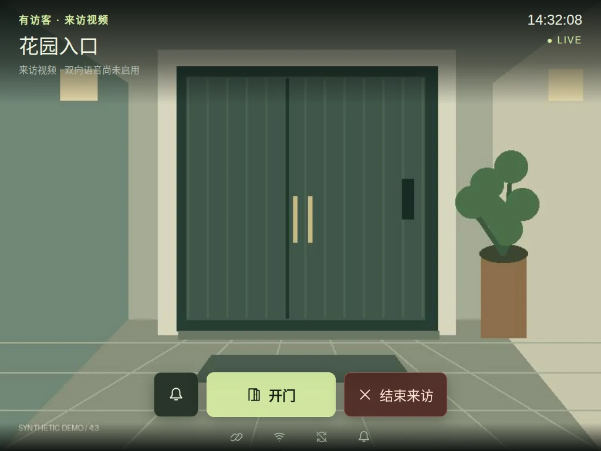
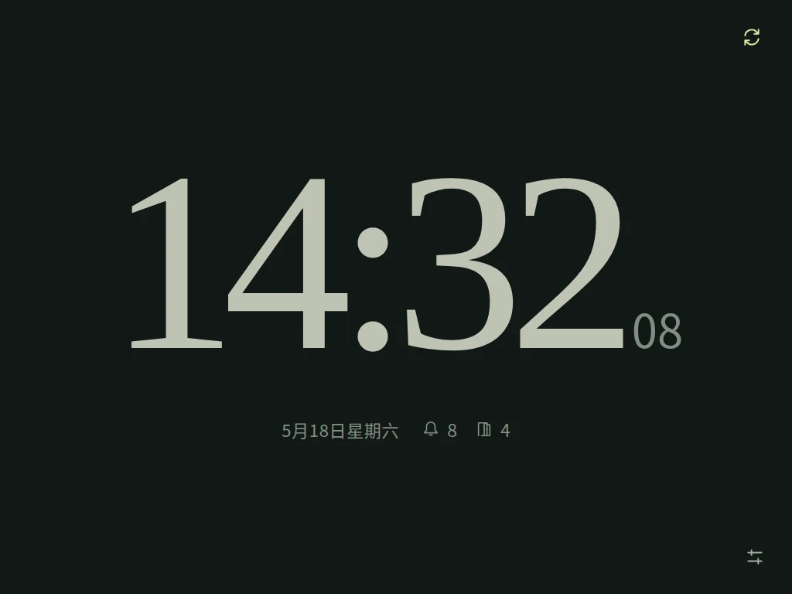
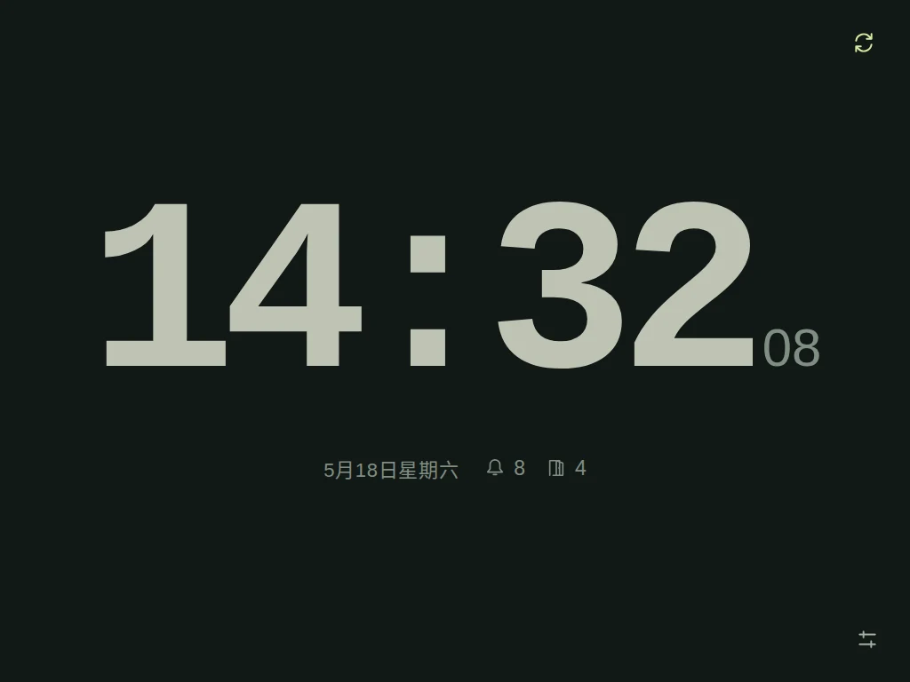
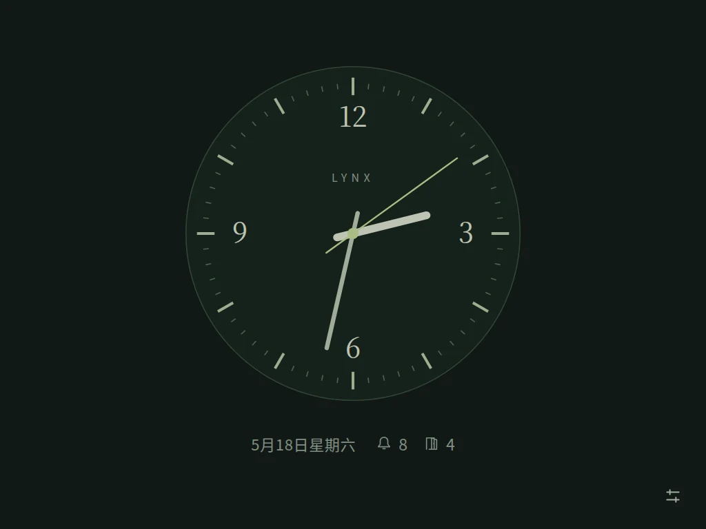
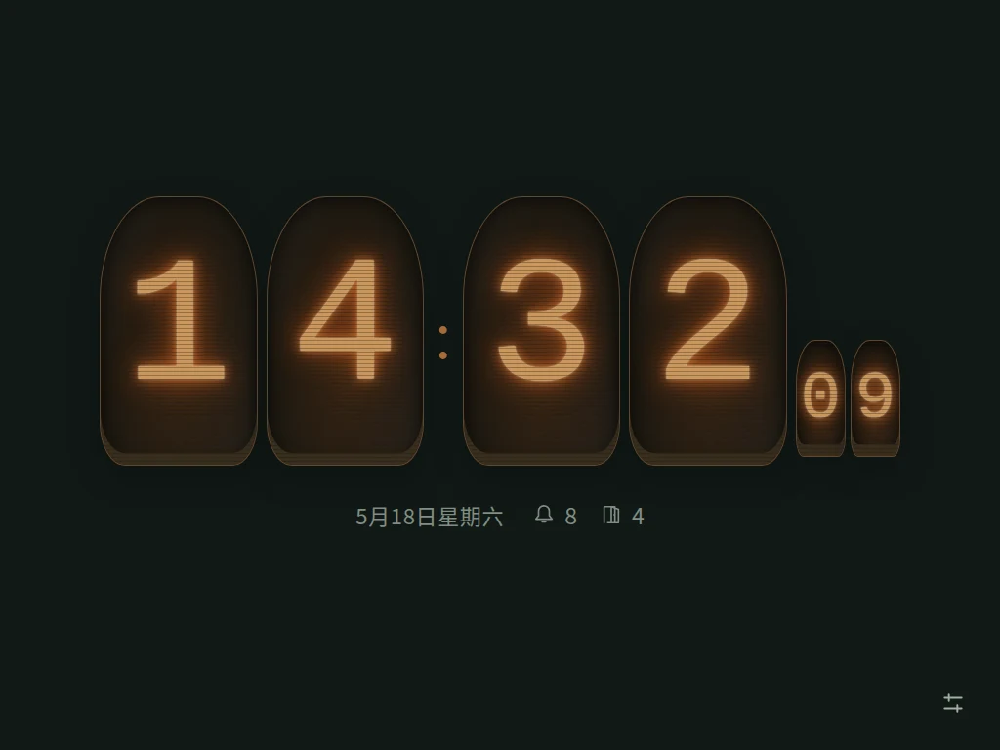
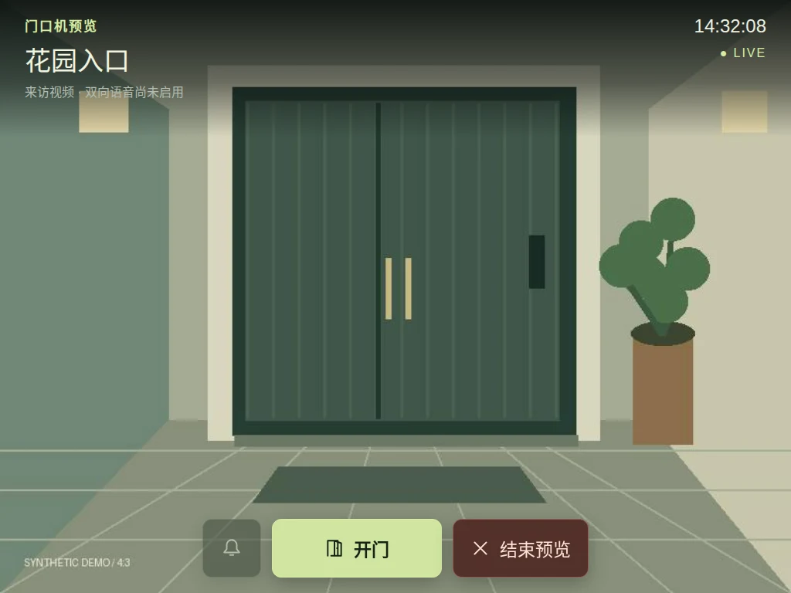
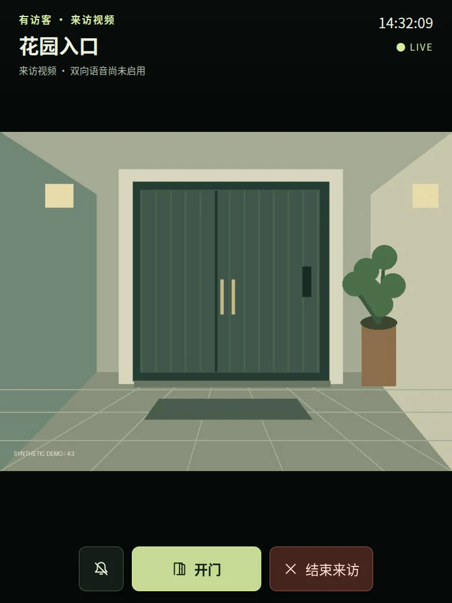
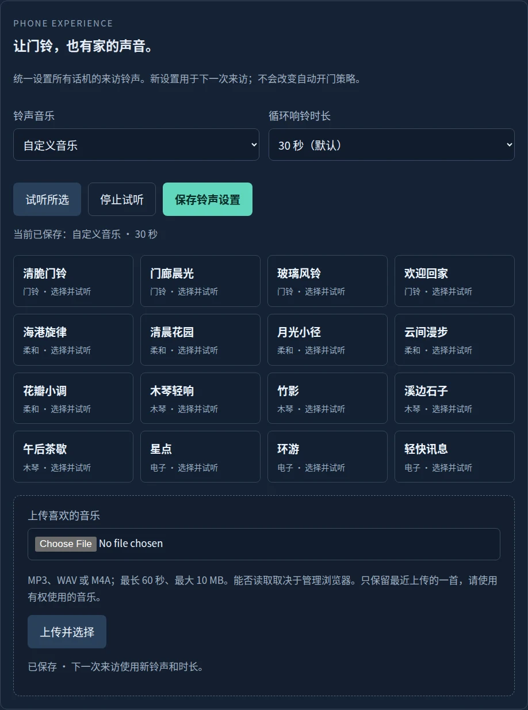
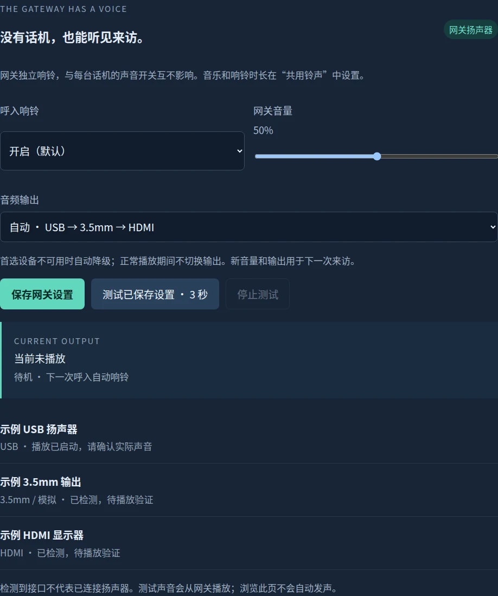

# 让门禁，成为家的一部分。

[English introduction](../README.md) · [图文用户手册](user-guide.zh-CN.md) · [完整 Demo 图集](demo-gallery.md)

LYNX Gateway 把兼容门禁的来访视频和日常操作，带到一块可以放在客厅、书房或厨房的屏幕上。空闲时是一只安静的时钟；有人来访时，完整的入口画面和清楚的大按钮自然出现。

*这是 v0.4.0 之后开发版的真实界面预览；图中数据和建筑插画均为合成示例，并非现场摄像画面。时钟、铃声配置和视频布局从 0.3.0 起提供；16 首铃声和本页管理布局从 0.4.0 起提供。*

## 一台话机，几种家的表情

喜欢简洁，就用雅致数字；希望远远看清，就选清晰电子钟；钟爱熟悉的表盘，就让秒针慢慢走；偏爱复古，则可以留下一点电子管的暖光。每台设备都能有自己的选择。

| 雅致数字 | 清晰电子 |
|---|---|
|  |  |
| 经典表盘 | 暖光电子管 |
|  |  |

秒数可以隐藏，模拟秒针可以跳动或平滑运行。字体和触控区域经过放大，连接状态等次要信息则维持柔和的颜色，方便看清，也不过分抢眼。

## 把空间留给来访画面

4:3 视频保持完整比例，充分利用横屏空间。标题、时间和半透明控件放在画面边缘，避免用固定的多层栏位挤压视频。竖屏依然保留完整画面，重要内容不被裁掉。

| 入口预览 | 竖屏来访 |
|---|---|
|  |  |

看到画面不等于已经接听：当前功能是视频、允许的门禁操作与挂断，双向语音仍在后续范围中。

## 让门铃，也有熟悉的声音

管理员可以在原创内置旋律中选择，或上传一段自己的音乐。15、30、45、60 秒循环时长可选，默认 30 秒；本次静音、来访结束或失联都会停止播放。到时停止铃声，画面和操作仍然留在屏幕上。

16 首原创短旋律分组选择，可逐一试听，也可上传自己的音乐。[查看铃声与离线试听](ringtones.md)。

## 自托管，日常使用有边界

网关运行在自己的 Linux 主机上；话机获得的是指定入口的日常授权，管理员设置仍需管理登录。设备可以逐个撤销，密码变化也会使设备授权失效。刷新、短暂断网和网关重启后能恢复授权与状态，控制命令不会被自动重放。

完整事件日志和现有自动开门策略保留在管理页。录制、双向语音、Webhook 和 MCP 尚未实现；本项目不宣称适配所有楼宇，也不是 FERMAX 官方产品。需要兼容的设备、有效的本户配置和协议密钥。

## 先看看，再开始

- [查看所有界面的完整图集](demo-gallery.md)：登录、授权、四种时钟、偏好、来访、预览、静音、超时、离线、管理员音乐/设备/网络/密码及日志。
- [打开本地 Demo 查看器](demo/index.html)：下载仓库后直接打开，可切换预览；不会连接任何门禁。
- [按图文手册设置](user-guide.zh-CN.md)：从准备、安装、授权，到选曲和常见问题。
- [选择已发布版本](https://github.com/helixzz/fermax-lynx-gateway/releases)：核对功能范围与更新记录。

旧 iPadOS 15、实际响铃及长时间前台常驻还需要实机验证；合成预览不代替这些验收。欢迎通过 [Issues](https://github.com/helixzz/fermax-lynx-gateway/issues) 提交不含私有现场资料的反馈。

## 网关也有自己的声音（开发版）

没有打开平板，也能通过网关扬声器听见来访。独立开关和音量，USB、模拟与 HDMI 自动选择；Web 与实体屏幕都能设置。详见[操作手册与硬件验收边界](gateway-audio.md)。

