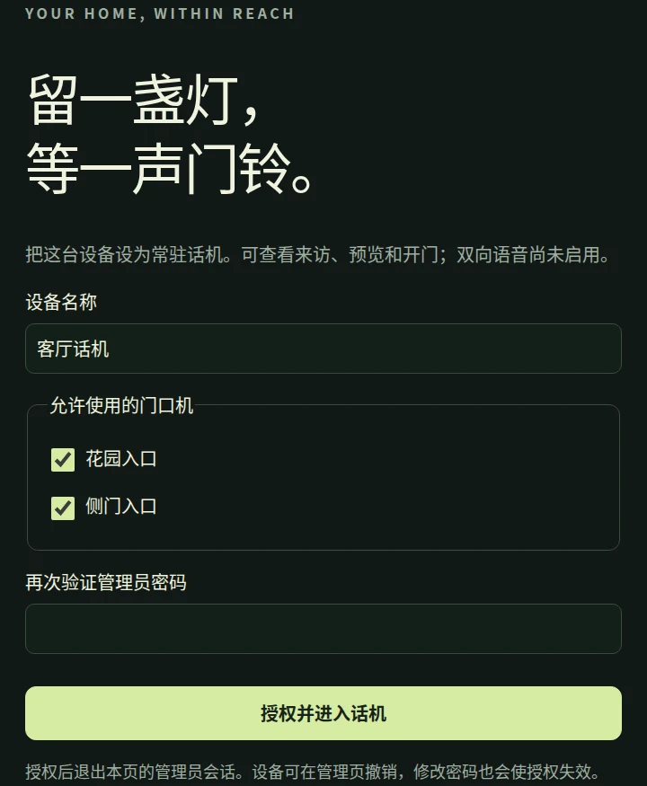
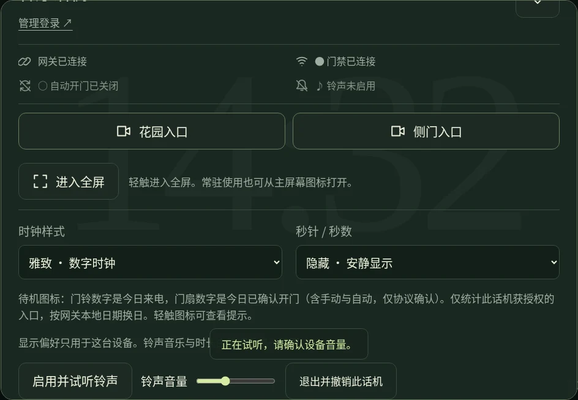
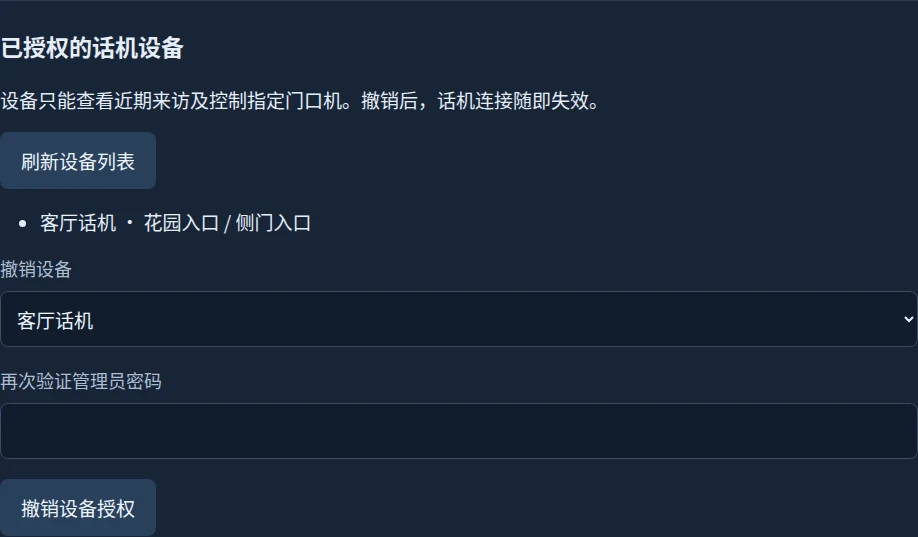
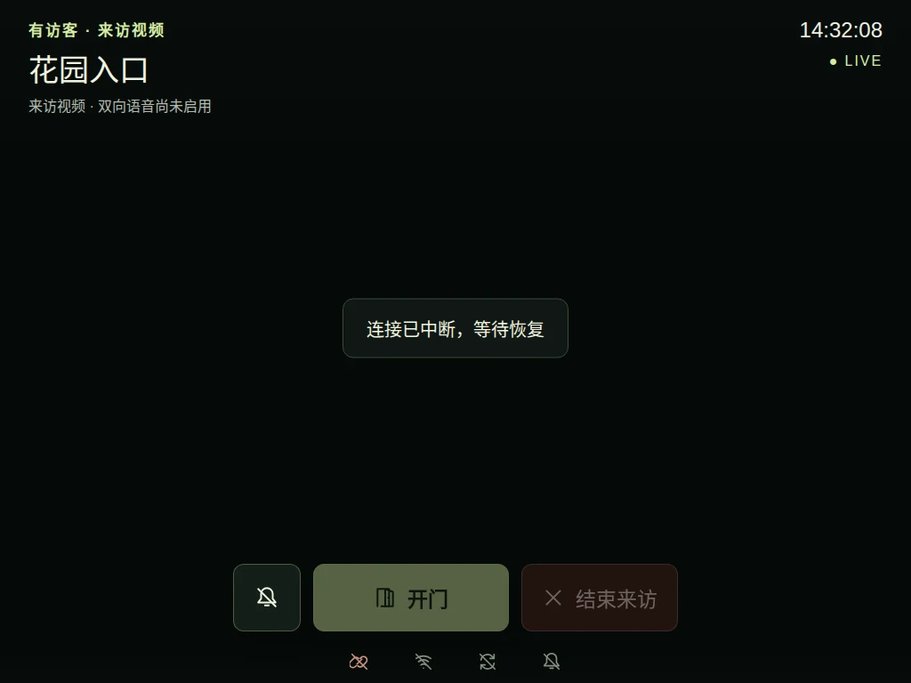
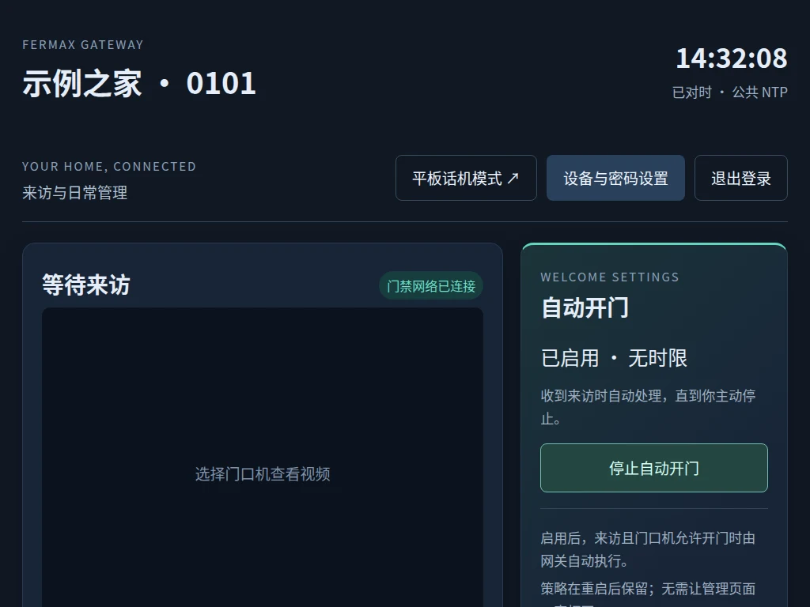

# Illustrated user guide

[Home](../README.md) · [中文完整手册](user-guide.zh-CN.md) · [Every screen](demo-gallery.md)

This guide covers v0.5.0, including independent gateway sound, the 16-track library and revised administrator layout.
All previews use synthetic data;
check the [changelog](../CHANGELOG.md) before choosing a release. UI labels are Chinese.

## Install and connect

Use a Linux host with separate home/intercom interfaces and your own compatible site
identity, addresses and 24-byte protocol key. Download a source release and verify
`sha256sum -c SHA256SUMS` before extraction. From the extracted source directory:

```sh
sudo apt update
sudo apt install python3-pil python3-protobuf python3-pycryptodome python3-enet python3-av alsa-utils
python3 -m fermax.admin init
python3 -m fermax.admin password
```

Set the correct private values in `~/.local/state/fermax/config.json`, supply `edk`
in the same directory with mode 0600, and configure Linux addresses separately.
The generated documentation addresses will not operate an installation. Keep the
intercom interface without a default route, avoid bridging the networks, and avoid
an address conflict with the original monitor. Start with `python3 -m fermax.main`.
The [deployment guide](deployment.md) covers systemd, time synchronization and LCD.

## Authorize a tablet

Open `http://<home-ip>:8765/`, log in, and choose **平板话机模式** (tablet mode). Name
the device, select its permitted entrances, re-enter the administrator password and
choose **授权并进入话机**. Enrollment ends that browser's administrator session.



Tap **启用并试听铃声** (enable and test ringing) and confirm actual sound. Device
grants survive refreshes and service restarts; clearing browser data, revoking the
device or changing the password requires fresh enrollment. A first touch of the
idle clock only reveals controls.

## Choose a clock and seconds behavior



Choose **雅致** (editorial), **清晰** (digital), **经典** (analog), or **暖光** (tube).
Seconds can be hidden, ticking or sweeping. Sweep applies to the analog hand; digital
seconds remain whole numbers. Reduced-motion preferences use ticking instead.
Style, seconds mode and volume belong to this browser, not every device. These
cosmetic preferences contain no credentials.

| Editorial | Analog |
|---|---|
|  |  |
| Digital | Tube |
|  |  |

The clock follows gateway time and labels unsynchronized/offline time. Dimming
changes page content, not screen backlight. Configure the device's auto-lock behavior;
background and locked-screen ringing are not guaranteed.

## Administrator music settings

In **设备与密码设置 → 铃声音乐**, choose one of 16 original phrases or upload custom music.
Track cards select and audition; **试听所选** plays one built-in phrase (up to 8 seconds
for custom music); **停止试听** stops it. Save **15, 30, 45 or 60 seconds** of
looping, with **30 seconds** as the default. New settings apply to the next incoming
visit on all tablets, without changing automatic opening or restarting the service.


For custom music, select a browser-decodable MP3, WAV or M4A of at most 60 seconds and
10 MB. Choose **上传并选择**, then **保存铃声设置**. Only the latest uploaded track is
retained. Use music you have rights to use; no external music service receives it.
If decoding fails, try WAV or another administrator browser. Unavailable custom
music falls back to the built-in chime with a message.

The ringing window starts when the gateway receives the visit. Joining late,
refreshing or reconnecting only uses the remaining time; an expired window is not
replayed. The melody loops until the limit, mute, disconnection or call end. Video
and controls remain available after ringing expires. Changes during an active visit
apply to the next visit.

## Incoming video and controls


Video uses the complete viewport with `contain` scaling, so the 4:3 image is neither
stretched nor cropped. Landscape tablets use more of the screen; portrait preserves
letterboxing. Large controls stay at the edges:

| Label | Action |
|---|---|
| 开门 | Request opening, only with a valid current session and panel permission |
| 结束来访 / 结束预览 | End the visit or preview |
| 本次静音 | Silence this visit immediately, keeping video and the next visit's ringing |
| 启用铃声 | Allow audio with a gesture when the browser has not enabled it yet |

This release does not implement two-way voice or present video as an answered call.
Opening results are associated with the originating request; uncertain outcomes are
not automatically retried. Existing automatic-opening policy runs on the gateway,
not separately in every tablet. An acknowledgement is not proof of physical opening.

## Devices, settings and events



Administrators can review entrance scope and revoke a device with password
confirmation. **退出并撤销此话机** on the tablet revokes its own grant. Closing the
page does not revoke it. Changing the administrator password revokes all phone grants.

Display preferences do not require device re-enrollment. Hardware/network settings
remain in management; saving them requires a service restart and does not configure
Linux interfaces. The recent-activity disclosure is in the tablet panel; the full
journal, filters and CSV export are in management.

## Troubleshooting and maintenance

| Symptom | What to check |
|---|---|
| No ring | Enable/test with a touch, check system mute and both volume settings. An expired ringing window will not restart. |
| Music upload fails | Use a decodable file within 60 seconds/10 MB; try WAV or another browser. |
| Offline | Controls disable and the old image clears. Wait for reconnection; controls are never replayed. |
| Stale video | The image is removed and explicitly marked unavailable. |
| Portrait bars | Expected when preserving the complete 4:3 frame; rotate to landscape for a larger view. |
| Authorization required | Check password changes, revocation or cleared browser storage, then enroll again. |



Before upgrading, confirm no active call and back up code plus the entire private
state directory, including `phone-preferences.json`, `phone-music/` and device grants.
Follow [deployment and rollback guidance](deployment.md); avoid restoring old state
that could undo credential revocations. Recover a forgotten password as the service
user: `python3 -m fermax.admin --state-dir /var/lib/fermax password`. API tokens are
independent and rotate with the `api-token` subcommand.

Old iPadOS 15, real tablet sound and 72-hour/seven-day endurance validation remain
outstanding. Voice, recording, webhooks, MCP and HTTPS are outside current scope.
See the [complete gallery](demo-gallery.md) for every normal and exceptional screen.

## Administrator navigation and policy state

The top navigation separates tablet mode from settings. Settings are grouped into
music, tablet devices, gateway configuration and password. **返回概览** returns to
the visitor view and journal.

An inactive automatic-opening policy shows the duration and Enable. An active policy
shows its end time or Unlimited and only **停止自动开门** (Stop). After confirmed stop
or expiry, Enable returns. Pending requests prevent duplicate submission; disconnected
pages hide policy controls until server state is known again. Another administrator's
changes appear on the next state refresh.



See [music provenance, offline audition and downgrade notes](ringtones.md). Before
rolling back to v0.3.0, save one of its original three IDs or existing custom music;
that version cannot load the new IDs. Preserve current credentials/device grants.

## Gateway speaker

Version 0.5.0 rings independently of browser phones, defaults on, and supports automatic USB → analog → HDMI routing with separate gain and Web/LCD settings. Read the [gateway sound guide](gateway-audio.md#english-quick-guide) for testing, fallback, installation and first-upgrade behavior.

## Daily activity and icons

The Web overview and local LCD show daily incoming visits and confirmed openings. Idle phones use icons and counts scoped to their authorized entrances; touch an icon for its meaning. Offline counts show —. Openings are protocol confirmations, not physical door-state measurements.

[统计口径与预览 · Counting rules and previews](daily-statistics.md)

## Quiet standby

Standby keeps the clock, grouped date/daily counts and a bottom-right controls entry. Touch empty space to open the panel. Device name, administrator link and full connection/policy/sound status are inside the panel; all four clock styles and existing preferences remain available.

An enabled automatic-opening policy retains a corner cycle icon. A crossed bell appears when sound is unenabled, at zero volume or blocked; touching it opens sound settings without changing volume or playing audio. Healthy connections stay quiet; disconnection gets an explicit notice and unavailable counts.

Use Escape to close and Tab to navigate. An active panel focus prevents timed dismissal; closing restores focus to the corner entry. Standby surfaces and indicators never actuate the door.


## Larger clocks and fullscreen on iPad

All four clocks expand within the available standby width and height; hiding seconds leaves more space for the main time. Open the controls panel and tap **Enter fullscreen** (进入全屏). Use the same button or browser gesture to exit. Loading, incoming calls and leaving fullscreen never automatically request fullscreen.

The page detects the standard API and the older WebKit-prefixed API. iPadOS 16.4 added the standard API; actual availability varies with browser and system version. Requests must originate from a user gesture and may be refused. Unsupported or refused requests show a Home Screen alternative without changing settings.

For iPad/iPhone: Safari **Share → Add to Home Screen**, then launch the new icon. Apple standalone metadata enables an app-like window without the usual Safari toolbars. A Home Screen window may require separate administrator login and phone enrollment. Standalone mode is distinct from Fullscreen API and does not prevent auto-lock or guarantee background ringing.

Sources: [Safari 16.4](https://webkit.org/blog/13966/webkit-features-in-safari-16-4/), [Fullscreen user activation](https://fullscreen.spec.whatwg.org/), [Apple standalone configuration](https://developer.apple.com/library/archive/documentation/AppleApplications/Reference/SafariWebContent/ConfiguringWebApplications/ConfiguringWebApplications.html).

## Screen wake lock and auto-lock

An enrolled foreground phone requests a screen wake lock independently of sound or a ringtone preview. The controls panel reports the actual state and offers stop/retry. Hiding, leaving or signing out releases the lock; returning to the foreground re-acquires it. System release or rejection does not create an automatic retry loop.

**Ordinary LAN HTTP cannot use the standard API.** A trusted HTTPS connection and browser support are required; bypassing a certificate warning is not equivalent to trust. Safari 16.4 introduced Screen Wake Lock, and Home Screen web app support was fixed in 18.4. Fullscreen and Home Screen installation do not themselves prevent auto-lock. Battery or system policies may still deny a request.

Unsupported/insecure pages display the reason instead of claiming success. On iPad, use Settings → Display & Brightness → Auto-Lock → Never, if available. A website cannot change that system setting. Background or manually locked-screen ringing remains unsupported.

Sources: [Safari 16.4](https://webkit.org/blog/13966/webkit-features-in-safari-16-4/), [Safari 18.4](https://webkit.org/blog/16574/webkit-features-in-safari-18-4/), [Wake Lock specification](https://www.w3.org/TR/screen-wake-lock/).

## Home Assistant pairing preview

Start with the [Home Assistant installation and recovery guide](home-assistant.md).
Requires gateway 0.7.0+ and HA 2026.9.0+; no MQTT broker or additional HA OS service.
Use manual installation or a HACS custom repository; default-store listing is pending.

The administrator’s External integrations section groups entrance scope and permissions. Pairing starts with read-only access and requires password confirmation.


After pairing, review each system’s scope and revoke its access separately with administrator confirmation.


## Calls that wait or cannot open

The administrator journal reports control recovery and unavailable control service. Initial read-only discovery uses at most three connection attempts within twelve seconds after the call is acknowledged. Opening is unavailable during recovery. Successful recovery resumes the existing policy; exhaustion stops further attempts, and call termination clears recovery state.

Opening commands and queries with possible automatic-opening effects are never replayed. An unknown opening outcome requires on-site confirmation. A connected network interface does not establish that the panel's control service is responding. Record the time, entrance and journal privately for diagnosis; automatic recovery does not identify the original cause of a timeout.
