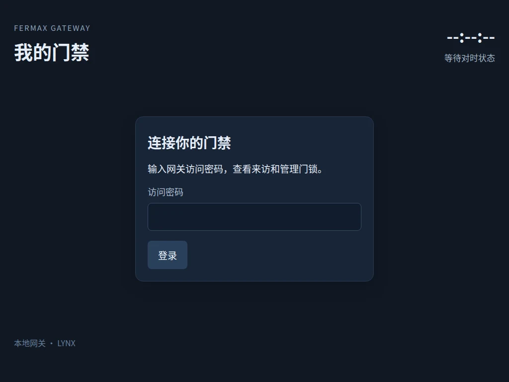
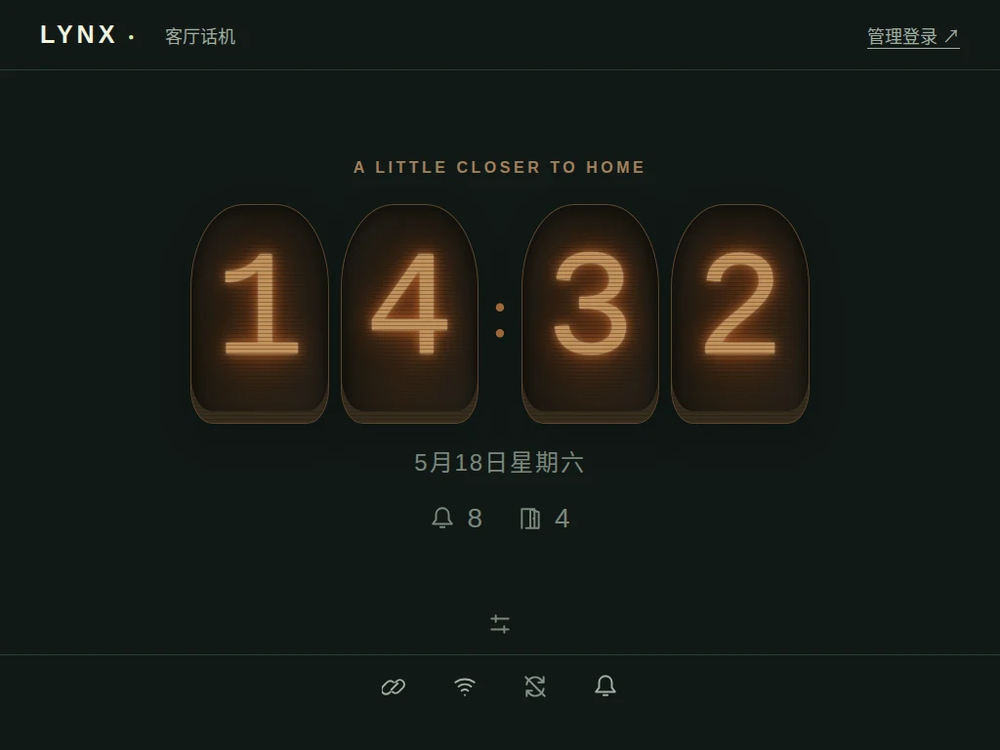
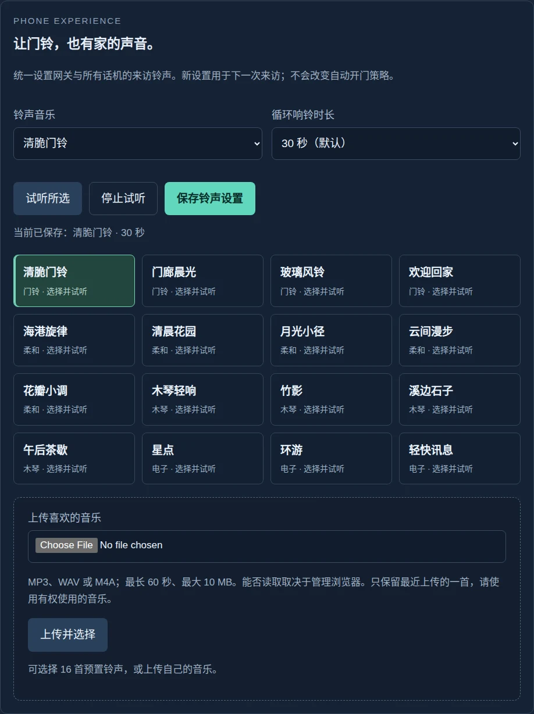
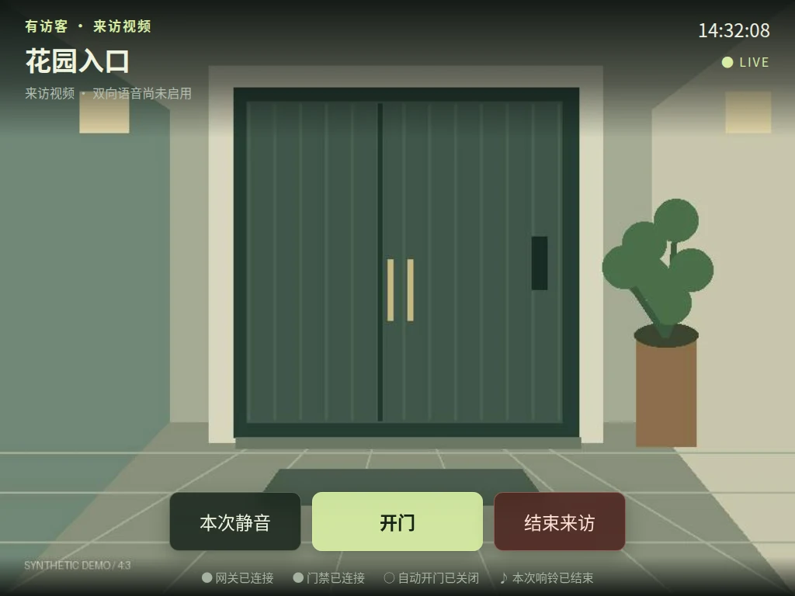
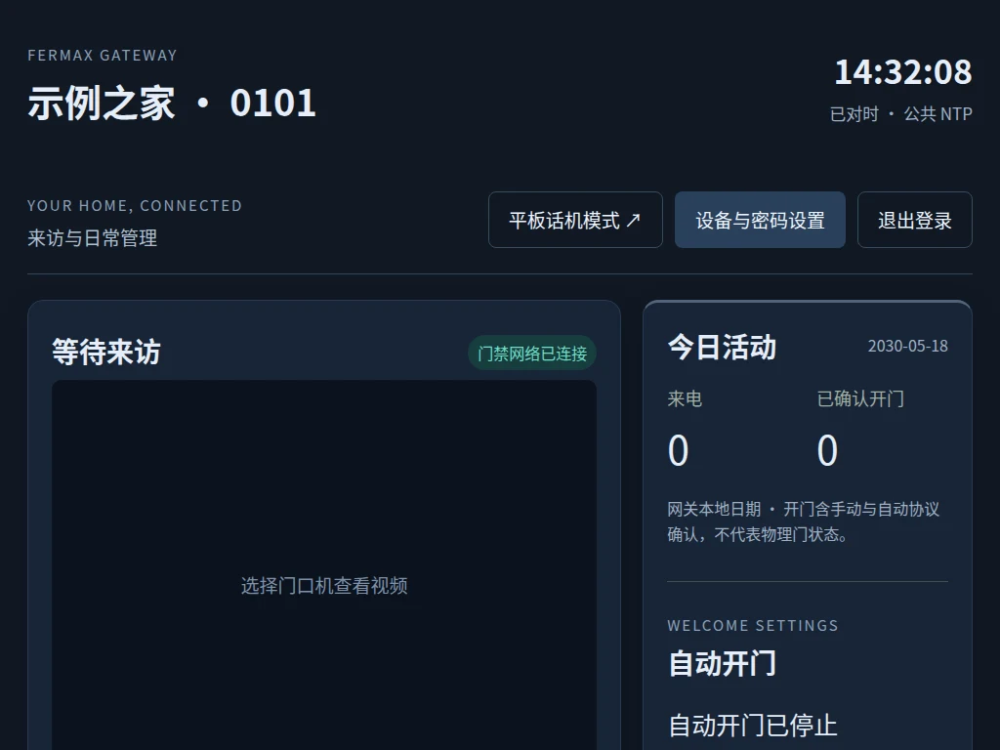
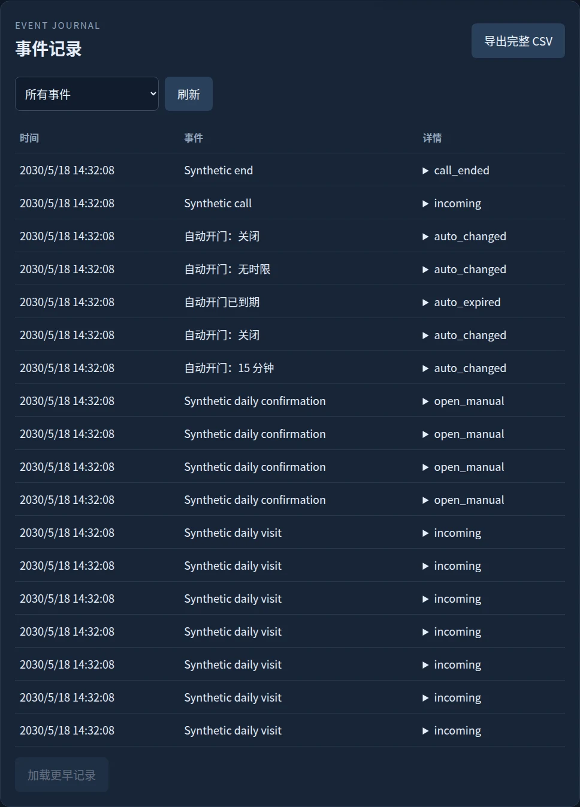
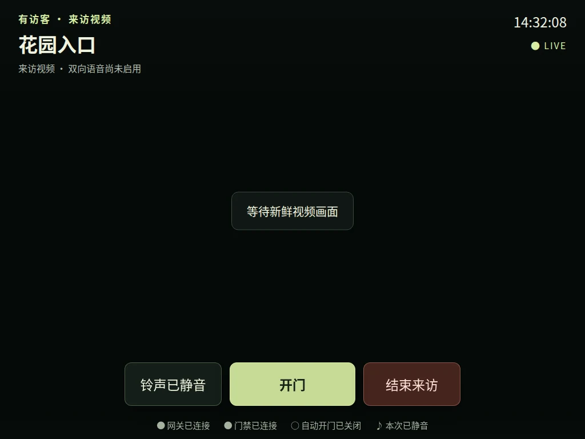

# LYNX Gateway 图文用户手册

[项目首页](../README.md) · [English](user-guide.md) · [全部界面预览](demo-gallery.md) · [项目简介](product.md)

本手册对应当前开发分支。时钟样式、可配置音乐与新版视频布局尚未包含在 v0.2.0 标签中；安装某个版本前请核对[更新记录](../CHANGELOG.md)。图中名称、时间、地址和门口画面均为合成示例。

## 1. 安装前准备

准备一台 Linux 主机，分别连接门禁网络与家庭网络。树莓派的以太网和 Wi-Fi 是一种可用组合。确认你拥有正确的本户身份、静态 IP、门口机地址及兼容的 24 字节协议密钥。软件不提供密钥提取，也不能替楼宇系统创建住户。

从 [Releases](https://github.com/helixzz/fermax-lynx-gateway/releases) 下载源码包与 SHA256SUMS，在同一目录运行 `sha256sum -c SHA256SUMS`，再解压源码包。在源码目录安装依赖并初始化：

```sh
sudo apt update
sudo apt install python3-pil python3-protobuf python3-pycryptodome python3-enet python3-av
python3 -m fermax.admin init
python3 -m fermax.admin password
```

按现场实际值编辑 `~/.local/state/fermax/config.json`，将自己的协议密钥保存为同目录的 `edk` 并执行 `chmod 600 ~/.local/state/fermax/edk`。初始化的示例地址不能原样用于门禁。

Linux 网卡 IP 另行配置，门禁接口不要设置默认路由；家庭网走另一接口，不桥接或开启转发。使用原室内机地址前避免两台设备同时占用。然后运行：

```sh
python3 -m fermax.main
```

常驻服务、NTP 和可选 LCD 的配置见[部署手册](deployment.md)。网页地址为 `http://<家庭网IP>:8765/`；若已修改端口，请使用对应端口。

## 2. 第一次登录与话机授权



1. 用刚设置的密码登录管理页，点击“平板话机模式”。
2. 给设备取一个易识别的名称，选择允许使用的门口机，再次验证管理员密码。
3. 点击“授权并进入话机”。本浏览器的管理会话随即退出；话机凭据仅用于授权范围内的日常功能。
4. 轻触“启用并试听铃声”，确认设备确实发声，再调整音量。


授权可以跨刷新和网关重启恢复；清理浏览器数据、主动撤销设备或修改密码后需要重新授权。初次触摸空闲时钟只会展开操作面板，不会直接开门。

## 3. 选择喜欢的时钟


轻触空闲页面，在“时钟样式”中选择：

| 样式 | 特点 | 预览 |
|---|---|---|
| 雅致 | 大号衬线数字，适合安静的家居界面 | [查看](demo/clock-editorial.webp) |
| 清晰 | 粗体电子数字，便于远处扫一眼 | [查看](demo/clock-digital.webp) |
| 经典 | 模拟表盘、时针与分针 | [查看](demo/clock-analog.webp) |
| 暖光 | 电子管玻璃与暖色发光效果 | [查看](demo/clock-nixie.webp) |

“秒针 / 秒数”可选隐藏、每秒跳动或平滑扫秒。平滑运动用于模拟表盘；数字和电子管依然按整数秒显示。在系统选择“减少动态效果”时，表盘退回跳秒。时钟样式、秒显示方式与音量仅保存在当前浏览器，不改变其他话机，也不保存密码或令牌。



次要状态文字保持柔和颜色；连接异常仍会明确提示。时间来自网关，失联或未对时时会标注。页面渐暗只改变网页内容，不控制屏幕背光。旧设备请在系统设置中调整自动锁定；后台或锁屏不保证来电响铃。

## 4. 管理员选择音乐和响铃时长

在管理页打开“设备与密码设置”，找到“让门铃，也有家的声音”。普通话机不能修改所有设备的音乐设置。



可选清脆门铃、海港旋律、木琴轻响，或自定义音乐。“试听 3 秒”用于确认选曲，“停止试听”立即停止。响铃时长可选 **15、30、45、60 秒**，默认 **30 秒**；它是整段循环播放的最长时间，不是单次音符或歌曲长度。点击“保存铃声设置”后，所有话机的下一次来访使用新设置，不需要重启。

### 上传自己的音乐

1. 选择浏览器能够解码的 MP3、WAV 或 M4A，最长 60 秒、最大 10 MB。较短的音乐会循环播放。
2. 点击“上传并选择”，等待上传完成。
3. 确认选中“自定义音乐”，选择时长，点击“保存铃声设置”。
4. 在实际话机上再次试听，确认音量和浏览器播放权限。


只保留最近上传的一首音乐。使用自己有权使用的内容；系统不会把音乐发往外部服务。浏览器不能解码时请更换文件或用较新的管理浏览器上传。自定义音乐暂不可用时，来访会回退到清脆门铃，并提示原因。

响铃窗口从网关收到来访开始计算。晚进入、刷新或恢复连接只使用剩余时长，超过窗口不会补响；到时停止的是铃声，视频和来访操作仍然可用。来访中已捕获的音乐/时长保持不变，新设置用于下一次来访。

## 5. 来访、预览与视频布局


画面以完整比例铺在整个视口中，不拉伸、不裁切。横屏 4:3 平板能充分利用屏幕；竖屏保留上下空白，避免切掉门口的人或环境。

- **开门**：只有当前会话有效且门口机允许时可用。按钮反馈只代表请求/协议结果；结果未知时先核对现场，不连续重试。
- **结束来访 / 结束预览**：结束当前会话。项目暂未实现双向语音，不将视频显示成“已接听”。
- **本次静音**：立即停止这次来访的铃声；不关闭视频，不影响下一次来访。若浏览器还未允许音频，这个位置先显示“启用铃声”。
- **预览**：空闲时展开操作面板，选择入口。预览不会响来访铃声。

| 预览 | 竖屏 |
|---|---|
|  |  |



同一次操作按请求 ID 对应结果，不会拿另一台话机的结果当作自己的结果。自动开门由网关现有策略统一执行，话机页面不会各自重复执行。

## 6. 设备管理、日志与退出


管理页可查看话机名称及授权入口，重新验证密码后撤销设备。话机操作面板的“退出并撤销此话机”会撤销本机授权；仅关闭网页不会撤销。修改管理员密码会使所有话机授权失效。想调整显示风格，无需撤销或重新授权。



管理页也保留自动开门策略、设备配置和完整事件日志。设备/网络配置保存后需要重启服务，且不会替你修改 Linux 网卡地址；不要在有通话时重启。近期活动可在话机面板展开，完整记录及 CSV 导出在管理页。



## 7. 常见情况

| 情况 | 建议 |
|---|---|
| 没有声音 | 轻触启用并试听；检查系统静音、媒体音量、页面音量和浏览器权限。过了本次响铃时段不会补响。 |
| 自定义音乐无法上传 | 使用 60 秒内、10 MB 内可解码的音频；尝试 WAV 或另一台管理浏览器。 |
| 页面提示失联 | 控制会禁用，旧画面会清除；恢复网络后等待快照恢复，不会自动重发开门。 |
| 视频暂停 | 页面明确显示等待新画面；不要把旧图当成实时画面。 |
| 竖屏视频上下留黑 | 这是保留完整 4:3 画面的结果；横屏能利用更多面积。 |
| 需要重新授权 | 检查设备是否被撤销、密码是否改变，或浏览器数据是否被清除，再从管理登录进入。 |
| 不支持保持亮屏 | 调整系统自动锁定设置；添加到主屏幕也不能保证后台常驻响铃。 |

| 视频停滞 | 网络失联 |
|---|---|
|  |  |

## 8. 升级、备份与密码恢复

升级前确认没有通话，备份完整代码和私有状态，按[部署说明](deployment.md)操作。新版铃声设置保存在状态目录的 `phone-preferences.json`，上传音乐在 `phone-music/`；连同设备授权和其他私有状态一起备份，不发布到 GitHub。回滚时先考虑只回滚代码，不盲目恢复可能撤销过凭据的旧状态。

忘记密码时，以服务用户和正确的状态目录运行：

```sh
python3 -m fermax.admin --state-dir /var/lib/fermax password
```

这会撤销网页会话与话机授权，无需手工修改密码哈希。API token 独立管理，使用 `api-token` 子命令轮换；新 token 写入文件，不打印到终端。

本项目是非官方实验性互通实现。旧 iPadOS 15、实际声音及长时间常驻仍需现场验收；语音、录制、Webhook、MCP 和 HTTPS 尚未实现。[全部界面图集](demo-gallery.md)包含登录、设备配置、密码设置、异常状态等完整预览。
